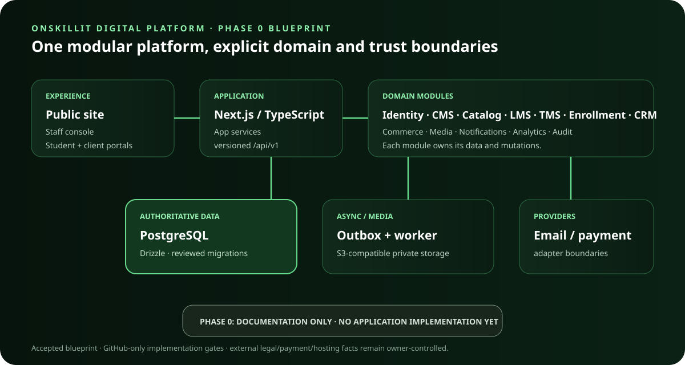

<!-- deterministic-state-bridge: onskillit-platform -->

**Machine-generated operational state:** see [`.repo/STATUS.md`](.repo/STATUS.md) (generated by `tools/repo_knowledge`). For cross-project SKB registry state, see [`onskillit-platform.json`](https://github.com/soobujmiah/skb/blob/main/projects/registry/onskillit-platform.json) in the parent SKB repository (`soobujmiah/skb`).
# OnSkillIT Digital Platform — documentation workspace

Current work: PHASE-05 public core is IN PROGRESS with PUBLIC CORE VERIFIED open; see `docs/PHASE-05-WORKLOG.md`.

The [GitHub Pages Phase 5 preview](https://soobujmiah.github.io/onskillit-platform/) presents confirmed English/Bangla business copy for review. It is static and noindex; the server application and external-domain deployment remain separate.

Status: PHASE-00 through PHASE-04 gates passed. PHASE-04 CMS and publishing core passed PUBLISHING CORE VERIFIED on synthetic GitHub evidence. See `docs/PHASE-04-WORKLOG.md` and `docs/CMS-PUBLISHING.md`. No production deployment or data migration has occurred. The public GitHub repository is `soobujmiah/onskillit-platform`.

Read `docs/READINESS.md`, `docs/SPECIFICATION.md`, `docs/SITE-AUDIT.md`, `docs/DESIGN-SYSTEM.md`, `docs/DOMAIN-WORKFLOWS.md`, `docs/ARCHITECTURE.md`, `docs/DATA-MODEL.md`, `docs/API-CONTRACT.md`, `docs/TECHNOLOGY-EVALUATION.md`, `docs/PAYMENTS.md`, `docs/SECURITY-ARCHITECTURE.md`, `docs/SEO-CONTENT.md`, `docs/QUALITY-GATES.md`, `docs/OPERATIONS.md`, `docs/PHASES.md`, `docs/PAGES.md`, `docs/SITEMAP.md`, `docs/OFFERINGS.md`, `docs/HOSTING-CAPABILITY.md`, `docs/LEGAL-IDENTITY.md`, `docs/LEGACY-URL-DISPOSITION.md`, `docs/UX-CONCEPT-REVIEW.md`, `docs/DOMAIN-CONSISTENCY.md`, `docs/ROADMAP.md`, `docs/RISKS.md`, `docs/TRACEABILITY.md`, `docs/phases/PHASE-0.md`, and `docs/HANDOFF.md`. Evidence labels: **Observed** = directly seen in a source; **Confirmed** = stated by founding partner; **Proposed** = recommendation; **Unknown** = needs evidence or decision. A dated observation is not a permanent fact.

Canonical governance: `soobujmiah/skb`, beginning with `ASSISTANT_CONTEXT.md`, `profile/assistant-guidance.md`, and applicable standards including `standards/policy-resolution.md` and `standards/ai-project-repository-bootstrap.md`. Future repository source and CI evidence govern implementation facts. Per owner instruction, all builds and tests run on GitHub, with no local builds or tests.

This repository also carries `.repo/` — deterministic, non-LLM repository state (head commit, build status, event history) maintained by `tools/repo_knowledge/` and `.github/workflows/repo-knowledge-sync.yml`, per `soobujmiah/skb`'s `governance/DETERMINISTIC_STATE_SYNC_POLICY.md`. See `docs/OPERATIONS.md` for what it currently covers at this Phase 0 stage.
