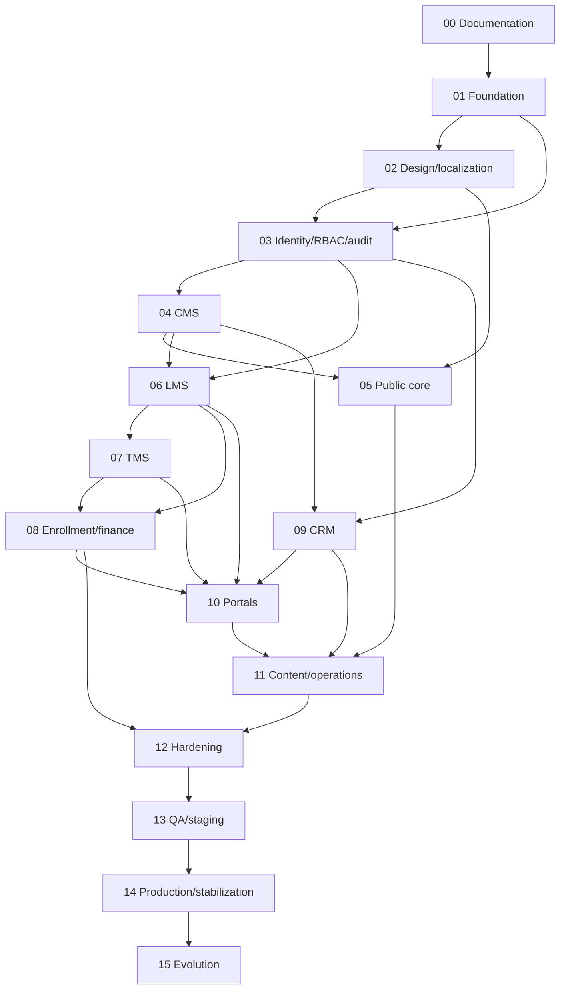

# Canonical phase architecture

Status: **canonical baseline accepted by founding-partner instruction, 2026-09-24**. This is the sole phase register. Phase 0 is **COMPLETE; DOCUMENTATION READY gate passed** under the founding partner’s final closure instruction; PHASE-01 through PHASE-15 are **NOT STARTED**. No implementation occurred during closure. Phase numbers name milestones, not permission to skip dependencies. V1 runs through PHASE-14; PHASE-15 is controlled post-launch evolution. Page IDs and their single owning phase are authoritative in [PAGES.md](PAGES.md).

## Master register

| ID | Name | Objective | Main deliverables | Dependencies | Gate | State |
|---|---|---|---|---|---|---|
| PHASE-00 | Discovery and documentation | Approve a coherent product and architecture | Evidence-bounded facts, UX, contracts, ADRs, traceability | None | DOCUMENTATION READY | COMPLETE |
| PHASE-01 | GitHub foundation | Establish portable runtime and evidence pipeline | Repo structure, CI, isolated preview, migrations | 00 | FOUNDATION VERIFIED | NOT STARTED |
| PHASE-02 | Design and localization shell | Establish shared accessible bilingual and themed UI | Tokens, shells, language and theme infrastructure | 01 | EXPERIENCE FOUNDATION VERIFIED | NOT STARTED |
| PHASE-03 | Identity, RBAC and audit | Secure all private operations | Accounts, sessions, scoped roles, audit | 01,02 | IDENTITY VERIFIED | NOT STARTED |
| PHASE-04 | CMS and publishing core | Enable controlled content operations | Typed pages, revisions, media, navigation, SEO fields | 03 | PUBLISHING CORE VERIFIED | NOT STARTED |
| PHASE-05 | Public business site | Publish verified business and service content | Public core, services, inquiries, legal and SEO baseline | 02,04 | PUBLIC CORE VERIFIED | NOT STARTED |
| PHASE-06 | LMS and course catalog | Deliver real learning workflows | Courses, editions, lessons, assessments, progress | 03,04 | LEARNING VERIFIED | NOT STARTED |
| PHASE-07 | TMS and training catalog | Manage scheduled delivery | Programs, batches, sessions, attendance, results | 06 | TRAINING VERIFIED | NOT STARTED |
| PHASE-08 | Enrollment and finance | Connect learning/training to payment | Enrollment, capacity, invoices, provider adapters, refunds | 06,07,03 | COMMERCE VERIFIED | NOT STARTED |
| PHASE-09 | CRM and client operations | Run lead to client service lifecycle | Leads, accounts, engagements, projects, activities | 03,04,05 | CLIENT OPERATIONS VERIFIED | NOT STARTED |
| PHASE-10 | Student and client portals | Expose scoped self-service | Learner, instructor and client task views | 06,07,08,09 | PORTALS VERIFIED | NOT STARTED |
| PHASE-11 | Content and business operations | Complete publication and operational insight | Blog, portfolio, team, search, notices, analytics | 05,09,10 | OPERATIONS VERIFIED | NOT STARTED |
| PHASE-12 | Cross-system hardening | Meet whole-product quality targets | Security, SEO, performance, access and recovery fixes | 08,11 | HARDENING VERIFIED | NOT STARTED |
| PHASE-13 | Integrated QA and staging | Prove V1 with realistic workflows | Full CI, UAT, restore/rollback drill, release candidate | 12 | RELEASE CANDIDATE APPROVED | NOT STARTED |
| PHASE-14 | Production launch and stabilization | Release only with owner authorization | Production deploy, monitoring, support, incident review | 13 | PRODUCTION ACCEPTED | NOT STARTED |
| PHASE-15 | Governed evolution | Add approved future capabilities | New ADRs, requirements, phases/pages if needed | 14 | CHANGE-SPECIFIC GATE | NOT STARTED |

## Dependency graph

After PHASE-04, the LMS track and CRM track have independent domain work; agents may prepare them in parallel only with separate reviewable branches and an explicit integration plan. Only one phase is normally the active implementation phase. An exception records parallel ownership and integration gate in the work log. No phase is skipped; a changed dependency requires an ADR and register update.

## Detailed phase contracts

Every implementation phase inherits these requirements: GitHub-only builds and tests; reviewed PR; security/privacy review; updated affected docs, ADRs and traceability; page and API/schema consistency; no production secrets in PR CI. A gate needs linked GitHub run and commit evidence. “Pages” below refers to IDs in PAGES.md; components, tabs and dialogs are not pages. Proposed data/API names are conceptual until physical contracts are approved.

### PHASE-00 — Discovery and documentation

- **Responsibility/tools/approval:** product, research, UX, architecture, security and documentation; read-only site/repo research, GitHub review; founding-partner approval required.
- **Scope/inputs:** business discovery, site and portfolio audit, requirements, IA/sitemap/pages, UX/design/brand, technical/data/API/auth/RBAC/CMS/CRM/LMS/TMS/enrollment/payment/SEO/security, quality, CI/deployment/backup/observability, risks, ADRs and traceability. Input: owner prompt, verified SKB, existing evidence.
- **Out of scope/pages/modules/data/API:** no application implementation, deployment, migration or live payment; no page IDs built, no schema/migrations/endpoints. All modules are specified only.
- **Deliverables/docs:** approved specification, phase/page architecture, source-linked evidence, complete decisions/unknowns, acceptance matrix and readiness report.
- **Verification/exit/gate:** cross-document and route/phase consistency, evidence-bounded offerings, portable hosting and legal/payment configuration, accepted key ADRs and original textual UX. **DOCUMENTATION READY** passed under founding-partner final architectural delegation; external facts remain later release gates.

### PHASE-01 — GitHub foundation

- **Responsibility/tools/approval:** platform/DevOps/database/security; GitHub PR/Actions and approved preview provider; owner approves selected stack/hosting/data architecture.
- **Scope/inputs:** approved Phase 0 ADRs. Establish monorepo or selected structure, package lock, formatting/lint/typecheck/test/build in GitHub, preview/staging isolation, secret policy, health endpoint and initial migrations. **Out:** product pages, production deployment, live data.
- **Pages/modules/data/API:** SYS-NOT-FOUND and SYS-ERROR; platform/config/CI; migration baseline and health contract only.
- **Tests/docs/exit/gate:** GitHub clean build, deploy smoke, migration up/down on synthetic preview, least-privilege secret review; update OPERATIONS, ARCHITECTURE, DATA-MODEL, API-CONTRACT and TRACEABILITY. **FOUNDATION VERIFIED**.

### PHASE-02 — Design and localization shell

- **Responsibility/tools/approval:** UX/frontend/accessibility/localization; GitHub CI and browser preview; owner approves original design direction.
- **Scope/inputs:** Phase 1 and approved brand adaptation. Shared responsive public/private shells, tokens, typography, Bangla/English routing and script-purity pipeline, dark/light persistence, accessible patterns. **Out:** populated business pages or copied portfolio motion.
- **Pages/modules/data/API:** no new content pages; design/i18n/theme; preference storage/API only if authenticated persistence is approved.
- **Tests/docs/exit/gate:** GitHub component, viewport, keyboard, contrast, locale purity and theme-flash checks; update DESIGN-SYSTEM, UX, ACCESSIBILITY and TRACEABILITY. **EXPERIENCE FOUNDATION VERIFIED**.

### PHASE-03 — Identity, RBAC and audit

- **Responsibility/tools/approval:** backend/security/frontend; GitHub security CI; owner approves recovery proofing/auth architecture.
- **Scope/inputs:** Phases 1–2. Email-or-mobile/password registration, login/logout, reset including staff-assisted phone-only recovery, sessions, account status, multi-admin scoped RBAC and audit. **Out:** mandatory OTP, finance rights without reviewed scopes.
- **Pages/modules/data/API:** AUTH-SIGN-IN, AUTH-REGISTER, AUTH-RECOVERY, AUTH-RESET, USER-PROFILE, ADMIN-USERS, ADMIN-ROLES, ADMIN-AUDIT, SYS-FORBIDDEN; User, Contact, Session, Role, Permission, Assignment, AuditEvent; `/api/v1/auth`, users, roles, audit.
- **Tests/docs/exit/gate:** duplicate contacts, rate limiting, recovery abuse, delegated permission denial, audit event completeness; update AUTHENTICATION, AUTHORIZATION, SECURITY-ARCHITECTURE, DATA-MODEL, API-CONTRACT, TRACEABILITY. **IDENTITY VERIFIED**.

### PHASE-04 — CMS and publishing core

- **Responsibility/tools/approval:** CMS/backend/editor UX/security; GitHub CI; editorial workflow/rights owner review.
- **Scope/inputs:** Phase 3. Typed reusable sections, draft/review/publish/archive, revision/rollback, navigation, media, metadata, localized content, preview, schedules only if approved. **Out:** unverified public content and arbitrary executable page blocks.
- **Pages/modules/data/API:** ADMIN-CMS-PAGES, ADMIN-CMS-EDITOR, ADMIN-NAVIGATION, ADMIN-MEDIA, ADMIN-SEO, ADMIN-SITE-SETTINGS; Page, Section, Revision, MediaAsset, NavItem, Seo; `/api/v1/cms`, media, SEO. Typed collection views may use the same ADMIN-CMS-PAGES/EDITOR route shell; Service authoring is enabled with its entity in PHASE-05, without a new page template.
- **Tests/docs/exit/gate:** permissioned publish/rollback, private media, MIME, localized completeness, preview isolation; update CMS, SEO-CONTENT, DATA-MODEL, API-CONTRACT, TRACEABILITY. **PUBLISHING CORE VERIFIED**.

### PHASE-05 — Public business site

- **Responsibility/tools/approval:** frontend/content/SEO/backend; GitHub CI and preview; owner approves verified business claims/legal text.
- **Scope/inputs:** Phases 2,4. Public home, about, services and contact; privacy/terms/accessibility; SEO baseline, semantic navigation and inquiry capture. **Out:** demo offerings, premature course/portfolio pages or unverified legal entity claims.
- **Pages/modules/data/API:** PAGE-HOME, PAGE-ABOUT, PAGE-SERVICES, PAGE-SERVICE-DETAIL, PAGE-CONTACT, PAGE-FAQ, PAGE-PRIVACY, PAGE-TERMS, PAGE-ACCESSIBILITY; Service, Inquiry, localized Page; public CMS/service/inquiry contracts. Inquiry is a minimal append-only intake record here and becomes a Lead through an explicit mapping in PHASE-09; no full CRM is required in PHASE-05.
- **Tests/docs/exit/gate:** both locales/themes/viewports, content and structured-data review, inquiry abuse control, published-only sitemap; update SITEMAP, SEO-CONTENT, SPECIFICATION, TRACEABILITY. **PUBLIC CORE VERIFIED**.

### PHASE-06 — LMS and course catalog

- **Responsibility/tools/approval:** learning product/backend/frontend/security; GitHub CI; owner approves real curriculum/certificate policies.
- **Scope/inputs:** Phases 3,4. Course catalog, editions, modules/lessons/materials, basic assessment, learner progress and instructor assignment. **Out:** batch scheduling, payment and fictional courses.
- **Pages/modules/data/API:** PAGE-COURSES, PAGE-COURSE-DETAIL, USER-LEARNING, USER-LESSON, USER-ASSESSMENTS, ADMIN-COURSES, ADMIN-COURSE-EDITOR, ADMIN-ASSESSMENTS, ADMIN-INSTRUCTORS; Course, Edition, Module, Lesson, Assessment, Submission, Progress and a minimal staff-granted LearningAccess record; course/curriculum/assessment/progress/access contracts. PHASE-08 introduces customer-facing Enrollment requests, capacity and payment transitions and links successful enrollment to this entitlement; PHASE-06 does not claim checkout or admission.
- **Tests/docs/exit/gate:** edition stability, authorized lesson/material access, grading scope, mobile learning; update LMS, DATA-MODEL, API-CONTRACT, TRACEABILITY. **LEARNING VERIFIED**.

### PHASE-07 — TMS and training catalog

- **Responsibility/tools/approval:** training operations/backend/frontend; GitHub CI; trainer/schedule owner review.
- **Scope/inputs:** Phase 6. Programs, batches, sessions, calendar, trainer/classroom assignment, attendance and results; shared student identity and learning edition. **Out:** settlement or paid enrollment.
- **Pages/modules/data/API:** PAGE-PROGRAMS, PAGE-PROGRAM-DETAIL, PAGE-BATCH-DETAIL, USER-TRAINING, ADMIN-PROGRAMS, ADMIN-BATCHES, ADMIN-SESSIONS, ADMIN-ATTENDANCE; Program, Batch, Session, Assignment, TrainingParticipation, Attendance, Result; program/batch/session/attendance contracts. PHASE-07 allows staff-granted participation for attendance before PHASE-08 customer enrollment links an admitted record to that participation.
- **Tests/docs/exit/gate:** capacity metadata, timezone conflict, trainer scope, attendance correction history; update TMS, DOMAIN-WORKFLOWS, DATA-MODEL, API-CONTRACT, TRACEABILITY. **TRAINING VERIFIED**.

### PHASE-08 — Enrollment and finance

- **Responsibility/tools/approval:** finance/backend/security/QA; GitHub sandbox CI; partner approval of provider, merchant, refund/tax/legal policies.
- **Scope/inputs:** Phases 3,6,7. Course/batch enrollment, waitlist/transfer, invoice, online provider adapter(s), offline recording, webhook reconciliation and refund. **Out:** merchant credentials in repo, uncontracted provider claims, production transactions.
- **Pages/modules/data/API:** USER-ENROLLMENTS, USER-BILLING, ADMIN-ENROLLMENTS, ADMIN-INVOICES, ADMIN-TRANSACTIONS, ADMIN-PAYMENT-SETTINGS; Enrollment, Event, Invoice, Intent, Transaction, Refund; enrollment, invoice, intent, callback, refund contracts.
- **Tests/docs/exit/gate:** concurrent capacity, idempotent callbacks, failed/replayed payment, refund authorization, money reconciliation; update PAYMENTS, DOMAIN-WORKFLOWS, SECURITY-ARCHITECTURE, TRACEABILITY. **COMMERCE VERIFIED**.

### PHASE-09 — CRM and client operations

- **Responsibility/tools/approval:** sales/service product/backend/security; GitHub CI; owner approves client lifecycle and privacy.
- **Scope/inputs:** Phases 3,4,5. Lead qualification, account/contact, service request, project/engagement, activity/follow-up and staff notes. **Out:** exposing internal notes or speculative project automation.
- **Pages/modules/data/API:** ADMIN-LEADS, ADMIN-CLIENTS, ADMIN-PROJECTS, ADMIN-CRM-ACTIVITIES, ADMIN-SERVICE-REQUESTS; Lead, Account, Contact, Project, Activity, ServiceRequest; CRM/client/project/activity contracts.
- **Tests/docs/exit/gate:** conversion history, cross-account isolation, assignment scope and activity audit; update CRM, CLIENT-MANAGEMENT, DATA-MODEL, API-CONTRACT, TRACEABILITY. **CLIENT OPERATIONS VERIFIED**.

### PHASE-10 — Student and client portals

- **Responsibility/tools/approval:** portal UX/frontend/backend/security; GitHub browser/API CI; owner approves minimum client-visible fields.
- **Scope/inputs:** Phases 6–9. Personalized student and client dashboards, course/training status, results/certificates, scoped project/request/billing views, profile. **Out:** unrestricted client messages or documents without workflow/consent.
- **Pages/modules/data/API:** USER-DASHBOARD, USER-COURSES, USER-PROGRESS, USER-RESULTS, USER-CERTIFICATES, USER-NOTIFICATIONS, CLIENT-DASHBOARD, CLIENT-PROFILE, CLIENT-PROJECTS, CLIENT-PROJECT-DETAIL, CLIENT-REQUESTS, CLIENT-BILLING; Certificate, Notification, portal projections; scoped `/me`, `/client/me` contracts.
- **Tests/docs/exit/gate:** cross-student/client isolation, mobile tasks, revocation, certificate eligibility; update UX, LMS, TMS, CLIENT-MANAGEMENT, TRACEABILITY. **PORTALS VERIFIED**.

### PHASE-11 — Content and business operations

- **Responsibility/tools/approval:** editorial/SEO/analytics/frontend/backend; GitHub CI; owner approves rights and consent.
- **Scope/inputs:** Phases 5,9,10. Blog, portfolio, team, on-site search, consented public analytics, business dashboard and notices. **Out:** fake case studies/team claims or invasive tracking.
- **Pages/modules/data/API:** PAGE-PORTFOLIO, PAGE-PROJECT-DETAIL, PAGE-TEAM, PAGE-BLOG, PAGE-ARTICLE, ADMIN-CONTENT, ADMIN-ANALYTICS, ADMIN-NOTIFICATIONS; Article, Case, TeamMember, SearchDocument, Metric, Notification; content/search/event/notification contracts.
- **Tests/docs/exit/gate:** rights/approval, no draft indexing, localized SEO, search scope, consent, event deduplication; update SEO-CONTENT, SPECIFICATION, API-CONTRACT, TRACEABILITY. **OPERATIONS VERIFIED**.

### PHASE-12 — Cross-system hardening

- **Responsibility/tools/approval:** security/QA/performance/accessibility/SEO/operations; GitHub CI/staging; security and owner review.
- **Scope/inputs:** Phases 8,11. Threat fixes, WCAG task audit, Core Web Vitals, SEO crawl, privacy/retention, backup and observability. **Out:** unreviewed scope expansion.
- **Pages/modules/data/API:** all V1 page IDs; only corrective schema/API changes, no new page template.
- **Tests/docs/exit/gate:** security scan and penetration scope, locale/theme/responsive matrix, load tests, accessibility audit, restore proof; update QUALITY-GATES, SECURITY-ARCHITECTURE, OPERATIONS, TRACEABILITY. **HARDENING VERIFIED**.

### PHASE-13 — Integrated QA and staging

- **Responsibility/tools/approval:** QA/product/operations/security; GitHub CI and isolated staging; founding-partner UAT approval.
- **Scope/inputs:** Phase 12. End-to-end user/business flows, gateway sandbox, realistic synthetic data, redirect map, incident/rollback and restore drill. **Out:** production traffic or credentials in staging.
- **Pages/modules/data/API:** all V1 page IDs; only defects and approved contract fixes.
- **Tests/docs/exit/gate:** all P0/P1 criteria, full route crawl, two-language content sign-off, staging release evidence; update READINESS, OPERATIONS, TRACEABILITY and release notes. **RELEASE CANDIDATE APPROVED**.

### PHASE-14 — Production launch and stabilization

- **Responsibility/tools/approval:** release/operations/product/security; protected GitHub environment; explicit owner production/domain approval.
- **Scope/inputs:** Phase 13. Deploy, DNS/cutover only when approved, smoke/monitoring, incidents, rollback readiness and stabilization window. **Out:** unapproved old-site data migration or silent legal/payment configuration changes.
- **Pages/modules/data/API:** all V1 page IDs, deployed contracts and migrations; no new template.
- **Tests/docs/exit/gate:** production smoke and payments with approved merchant, uptime/error checks, backup restore evidence, incident triage and owner acceptance; update OPERATIONS, READINESS, CHANGELOG, TRACEABILITY. **PRODUCTION ACCEPTED**.

### PHASE-15 — Governed evolution

- **Responsibility/tools/approval:** relevant product/domain/security/operations owners; GitHub CI; owner approves changed business scope, major architecture/payment/security decisions.
- **Scope/inputs:** Phase 14 plus approved roadmap. OTP/2FA, extra provider, richer messaging/documents/careers/instructor profiles or mobile apps only after new requirements/ADRs. **Out:** automatic implementation of reserved templates or bypassing V1 gates.
- **Pages/modules/data/API:** FUT-* IDs in PAGES.md are reservations only; actual schema/endpoints specified by change proposal.
- **Tests/docs/exit/gate:** each change has its own requirements, security/privacy review, GitHub tests, docs and owner gate. **CHANGE-SPECIFIC GATE**; this phase remains an ongoing envelope, not proof that all future ideas are shipped.

## State, transition and change control

Allowed states: **NOT STARTED → IN PROGRESS → READY FOR GATE → GATE PASSED → COMPLETE**; **BLOCKED** records an impasse and reason, never a substitute for gate evidence. Only the gate reviewer may mark GATE PASSED; COMPLETE follows evidence archival. A phase finishes only when implementation, GitHub tests/build, security, docs, traceability, pages, database/API, CI and acceptance criteria all pass. Phase 0 uses documentation evidence in place of application evidence.

Every agent reads SKB/project instructions and current HEAD, then records: Current Phase, Phase Gate, Task, Module, Page IDs, Requirement IDs, Dependencies, Acceptance Criteria. Execute **READ → VERIFY → PLAN → IMPLEMENT → TEST → DOCUMENT → TRACE → COMMIT → VERIFY → REPORT**; in Phase 0, IMPLEMENT means documentation only. Before any implementation, identify current phase and relevant page IDs; `none` is valid for infrastructure tasks. Afterward record Tests, Security, Documentation, Traceability, Phase Status, Page Status and Commit. Chat history never sets phase state.

Once approved, adding/removing/merging/splitting phases, moving major scope or reordering critical dependencies requires an ADR, PHASES/PAGES/ROADMAP/TRACEABILITY updates and gate reevaluation. A newly discovered page receives a permanent ID, phase, route, sitemap/relationship/dependency/traceability entries and design pattern review before code. No undocumented pages or phase skipping.
