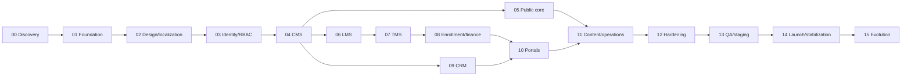

# Execution roadmap

[PHASES.md](PHASES.md) is the sole canonical phase register, dependency graph and gate definition. This page is a human-readable projection; changing it alone cannot change project scope. Phase 0 is in progress. No implementation phase is authorized.

| Phase | Milestone |
|---|---|
| PHASE-00 | Discovery and documentation |
| PHASE-01 | GitHub foundation |
| PHASE-02 | Design and localization shell |
| PHASE-03 | Identity, RBAC and audit |
| PHASE-04 | CMS and publishing core |
| PHASE-05 | Public business site |
| PHASE-06 | LMS and course catalog |
| PHASE-07 | TMS and training catalog |
| PHASE-08 | Enrollment and finance |
| PHASE-09 | CRM and client operations |
| PHASE-10 | Student and client portals |
| PHASE-11 | Content and business operations |
| PHASE-12 | Cross-system hardening |
| PHASE-13 | Integrated QA and staging |
| PHASE-14 | Production launch and stabilization |
| PHASE-15 | Governed evolution |

Parallel preparation is possible after the CMS gate: the LMS/TMS track and CRM track have separate domain work. Their integration meets at portals and operations. The dependency graph in PHASES.md, not this display order, governs when work may start. V1 includes all P0/P1 modules through PHASE-14; PHASE-15 contains reserved future work. Every page's implementation phase is in [PAGES.md](PAGES.md), and every requirement's chain is in [TRACEABILITY.md](TRACEABILITY.md).

Milestone handoff: record owner role, requirement/page IDs, ADRs, changed source/schema/API, acceptance criteria, GitHub workflow/run/commit, defects, security/privacy review, docs and rollback path. A phase cannot pass because documents or navigation stubs exist; it needs its gate evidence. Physical and production claims require evidence from the target environment. No local builds or tests.

## Immediate work

Finish Phase 0 evidence and approvals in [READINESS.md](READINESS.md). The first authorized implementation slice after that gate is PHASE-01 repository/CI/runtime foundation, then PHASE-02 shared visual/localization shell and PHASE-03 identity/RBAC/audit. Do not begin a homepage or production deployment merely because its design seems clear.
